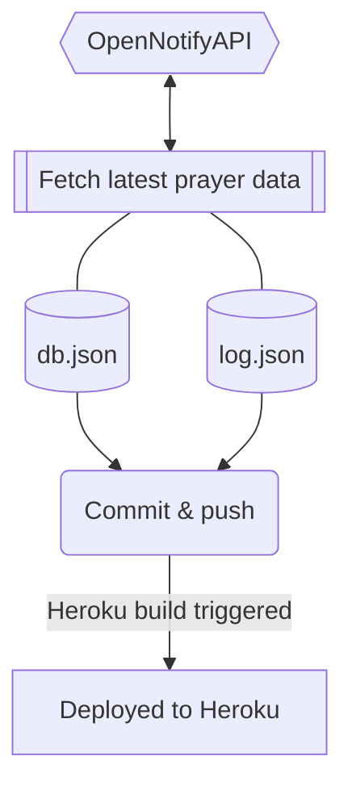

[](#put-it-togother-how-does-it-works)


# mpt-backup-api

**Attention** :exclamation: This API is meant to be used by the [Malaysia Prayer Time app](https://github.com/iqfareez/app_waktu_solat_malaysia) **as a backup** if JAKIM's API is unreachable.

## To run

### Pull the latest data from JAKIM.

Prerequisites: **Node** & **Python 3.10**

> **⚠️ Careful:** Don't run too much, for one run, it will poll this data from JAKIM server about 58 times _(number of zones, it could be more than that)_ every 1.5 secs. It will retry when fail getting a data for a zone.

Install required packages

```
pip install requests urllib3
```

Run the fetcher

```
py fetcher.py
```

### Start local server

```
npm install
```

Then

```
npm start
```

## Put it togother, how does it works?



> This workflow will trigger automatically on the first day of the month via [GitHub Actions](https://github.com/iqfareez/mpt-backup-api/actions/workflows/fetcher.yml).

[](https://github.com/iqfareez/mpt-backup-api/actions/workflows/fetcher.yml)

## References

1. [The idea behind automatic fetching and deploy using Python and GitHub](https://canovasjm.netlify.app/2020/11/29/github-actions-run-a-python-script-on-schedule-and-commit-changes/)
2. [The idea of this simple API architecture](https://youtu.be/FLnxgSZ0DG4)
3. [Website template](https://getbootstrap.com/docs/5.1/examples/starter-template)
